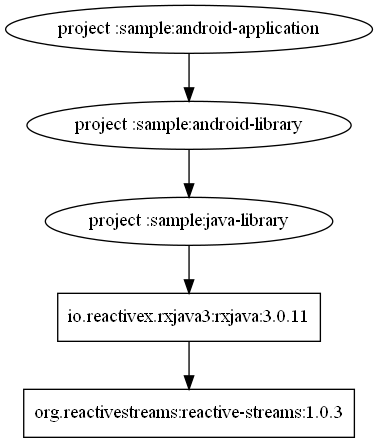
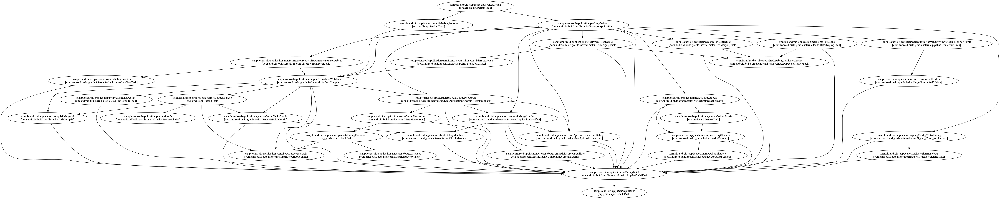
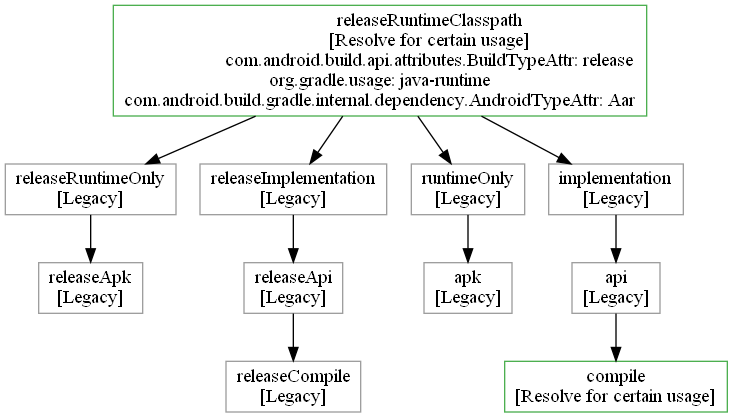

# GDR（Gradle Dependencies Reportor）
[](https://maven-badges.herokuapp.com/maven-central/com.chrnie.gdr/plugin)

Gradle 图形化依赖关系导出工具，支持导出：
1. 项目依赖关系图
2. 任务依赖关系图
3. 配置依赖关系图

## 用法

### 前置条件
本项目依赖 [graphviz](https://graphviz.org/) 生成依赖图，需要先下载安装该软件并将软件安装目录配置为 `GRAPHVIZ_HOME` 环境变量。

### 引入依赖
1. 根项目下的 build.gradle 文件中添加 repositories 和 classpath 依赖：
    ``` groovy
    buildscript {
        repositories {
            mavenCentral()
        }

        dependencies {
            classpath "com.chrnie.gdr:plugin:{version}"
        }
    }
    ```

2. 在需要导出依赖图的项目中应用插件：
    ``` groovy
    plugins {
        id("com.chrnie.gdr")
    }
    ```

### 执行任务

#### 导出项目依赖图

目前仅支持 android、java 类型项目使用。  
任务名：report{variant_name}ProjectDependencies  
参数：  
- type：指定要输出依赖的类型，可选值：all、project、external，默认值：all  

输出路径：build/reports/projectDependencies  

##### 示例
```
./gradlew :sample:android-application:reportReleaseProjectDependencies
```


#### 导出任务依赖图

任务名：reportTaskDependencies  
参数：  
- task：指定要输出依赖关系的任务名，如果不设置则输出当前项目下所有任务的依赖关系  
- includeDependentProject：是否包含依赖项目的任务  
- verbose：输出附加信息  

输出路径：build/reports/taskDependencies  

##### 示例
``` bash
./gradlew :sample:android-application:reportTaskDependencies --task="assembleDebug" --verbose
```


#### 导出配置依赖图

任务名：reportConfigurationDependencies  
参数：  
- configuration：指定要输出依赖关系的配置名，如果不设置则输出当前项目下所有配置的依赖关系  
- verbose：输出附加信息  

输出路径：build/reports/configurationDependencies  

##### 示例
```
./gradlew :sample:android-application:reportConfigurationDependencies --configuration="releaseRuntimeClasspath" --verbose
```


# 许可证
    Copyright 2021 ChenRenJie
    
    Licensed under the Apache License, Version 2.0 (the "License");
    you may not use this file except in compliance with the License.
    You may obtain a copy of the License at
    
       http://www.apache.org/licenses/LICENSE-2.0
    
    Unless required by applicable law or agreed to in writing, software
    distributed under the License is distributed on an "AS IS" BASIS,
    WITHOUT WARRANTIES OR CONDITIONS OF ANY KIND, either express or implied.
    See the License for the specific language governing permissions and
    limitations under the License.
